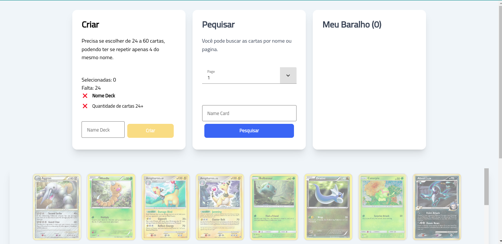
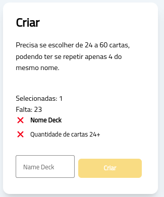
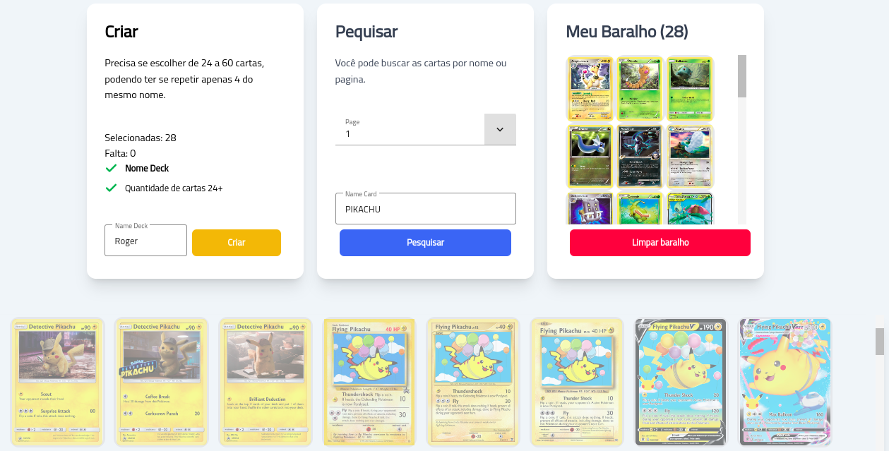
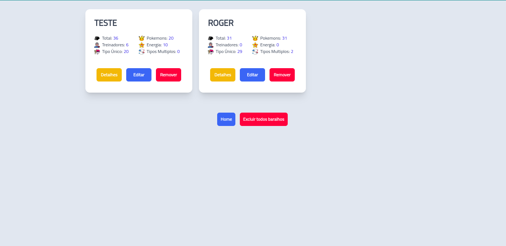
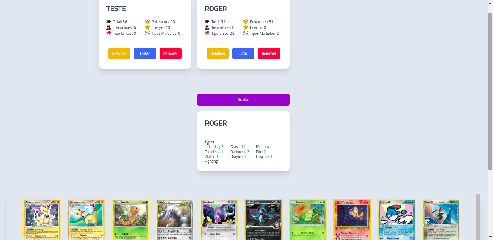

# Pokemon

Aplicação para consultar de cartas na api (https://docs.pokemontcg.io/#api_v1cards_list) e armazenamento de decks

Todo armazenamento dos baralhos feito no local storage, é utilizado session storage para salvamento do retorno da api, para ganhar agilidade.

## Project em Produção
https://rogerferreira.github.io/pokemontcg

## Especificações Técnicas

- Angular - 16.2.0
- Tailwind CSS - 3.4.4
- Ignite UI (Infragistics) - 16.1.3

## Pré Requisitos
Lista de baralhos
- O usuário pode ver seus baralhos;
- O usuário pode criar um novo baralho;
- O usuário pode remover um baralho;
- O usuário pode editar um baralho;
- O usuário pode clicar num baralho para visualizar seus detalhes.

Criação de um baralho
- O usuário pode colocar um nome no seu baralho;
- O usuário pode inserir cartas no baralho;
- O baralho tem que ter no mínimo 24 cartas e no máximo 60;
- Só podem ter 4 cartas com o mesmo nome, no baralho. (Nome não id);
- Após salvar o baralho voltamos para a página de lista de baralhos atualizada;
- O baralho será salvo apenas em memória.

Detalhes do baralho
- O usuário consegue ver quantos pokemons e cartas de treinador existem no baralho. (atributo supertype)
- O usuário consegue ver de quantas cores é o baralho. quantos types únicos existem no baralho.

## TELAS

Home 
- Tela inicial, é feito consulto api e salva no sessão as configurações iniciais.
- Caso não tenha baralhos cadastros, o botão meus baralhos fica desativado.

Create
- Tela para criação do baralho, salva no local storage
- Permite Zoom das cartas, para melhor visualização
- Permite consulta
  - Por Nome carta
  - Por Pagina
- Validações
  - Nome Deck maior 3 caractéres
  - Numero de cartas 24 a 60
  - Pequisa por nome carta maior 3 caractéres
- Enquanto as validações não são atingidas, o botão de salvar fica oculto.

My Deck 
- Lista Baralhos
- Exibe Detalhes
- Edita Baralhos
- Exclui Baralho
- Exclui Todos Baralhos
  
  
